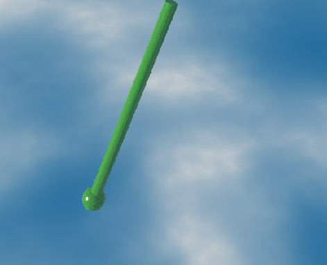

<!-- Enables MathJax -->

# About this project

This website gathers a series of projects developed during my undergraduate studies, focusing on the **computational simulation of physical systems**. The main goal is to make available:

- Interactive simulators that can be run directly in the browser  
- Theoretical explanations of the physical models involved  
- Well-documented and reusable source code

The simulations were implemented using **Python** and the **Godot Engine**, aiming to explore both the physical behavior and the computational visualization of the systems modeled.

> Note: This content is personal and independent, and has no formal affiliation with any academic institution or research program.

---

# Available simulators

## [Damped Pendulum](./simulators/damped_pendulum.html)  

  

  

    <strong><a href="./simulators/damped_pendulum.html">Damped Pendulum</a></strong> 
    A simulation of a damped pendulum system, exploring its oscillatory behavior under friction.
  

## [Coupled Mass-Spring System](./simulators/coupled_springs.html)  
## [Oscillating Rings](./simulators/oscillating_rings.html)  
## [Dancing Flames](./simulators/dancing_flames.html)  
## [Projectile with Spring](./simulators/projectile_spring.html)  
## [Inclined Plane with Ball](./simulators/inclined_plane.html)

Each simulation is accompanied by a brief theoretical description and the corresponding implementation. In some cases, the source code is available for download or direct access.

---

# About the author

My name is **Thales**, and I am a Physics undergraduate student at UFABC of Brazil.

For feedback, suggestions, or collaboration inquiries, feel free to reach out via [GitHub](https://github.com/Jumelord) or email.

---

This site is powered by [GitHub Pages](https://pages.github.com)  
Equations are rendered using [MathJax](https://www.mathjax.org/)

