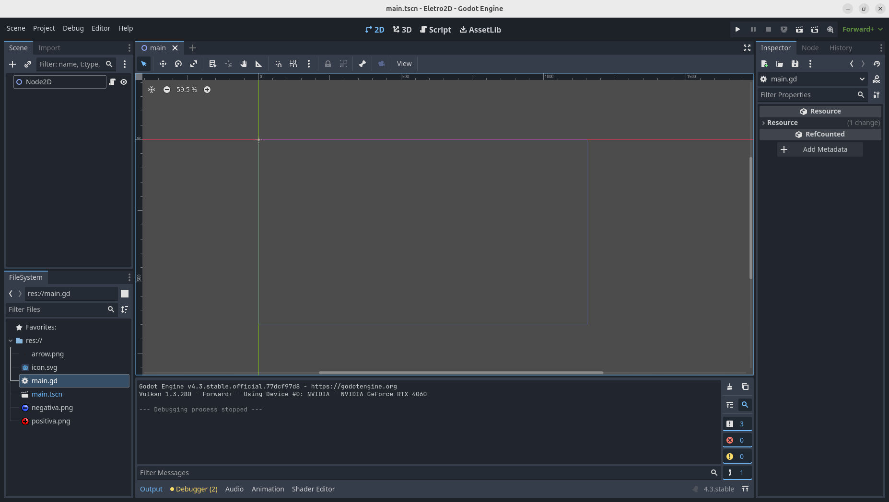

<head>

</head>

<!-- Enables MathJax -->

# 2D Electromagnetism

Electromagnetism in two dimensions is rewritten analogously to the three-dimensional model, but the laws and equations are still different. Thus, the content presented here involves a numerical modeling of Maxwell's equations to simulate the motion of point charges and the electric and magnetic fields in space. The entire theoretical model of Maxwell's equations rewritten for a two-dimensional world is based on the article "On Maxwell’s Electrodynamics in Two Spatial Dimensions", while the computational model is original. While the theory behind the equations can be somewhat complex, applying it in this simulation only requires basic knowledge of differential equations, and the implementation difficulty increases progressively.

## Point Charges and the Electric Field

### Gauss's Law

In two dimensions, Gauss's law takes a similar form, but both the charge density and the divergence must also be calculated in two dimensions.

$$
\vec{E} \equiv (E_x, E_y)
$$

$$
\nabla \equiv \frac{\partial E_x}{\partial x} + \frac{\partial E_y}{\partial y}
$$

$$
\rho(x,y) \equiv \frac{dq}{dA}
$$

Gauss's law becomes:

$$
\nabla \cdot \vec{E} = \frac{\rho}{\epsilon_o}
$$

The charge density of a point charge can be modeled as a generalized function called the Dirac delta, which depends only on position and returns zero at every point in space except at the origin, where it returns infinity.

$$
\delta(\vec{r}) = 
\begin{cases}
\infty & \text{if } \vec{r} \neq \vec{0} \\
0             & \text{if } \vec{r} = \vec{0}
\end{cases}
$$

$$
\rho(\vec{r}) = q\delta(\vec{r})
$$

From this, we can deduce the expression for the electric field of a point charge. Integrating both sides over a circular area centered on our point charge, and using Gauss’s theorem in two dimensions to convert the area integral into a line integral along the circumference, we obtain a closed-form expression for the field of the charge:

$$
\int \int_C \nabla \cdot \vec{E} ~dA = \frac{\int \int_C \rho ~dA}{\epsilon_o} 
$$

$$
\oint_{\partial C} \vec{E} \cdot \hat{n} ~dr  = \frac{\int \int_C q\delta(\vec{r}) ~dA}{\epsilon_o} 
$$

$$
E \oint_{\partial C} ~dr  = \frac{q}{\epsilon_o} 
$$

$$
E (2 \pi |r|)  = \frac{q}{\epsilon_o} 
$$

$$
E = \frac{q}{2 \pi \epsilon_o |r|} 
$$

### Godot Setup

Para começar a escrever nosso código precisamos ter alguns recursos disponíveis no editor. Portanto precisamos:

* Criar um nó raiz
* Importar uma imagem de carga positiva
* Importar uma imagem de carga negativa
* Importar uma imagem de uma seta

### Criando um campo vetorial

