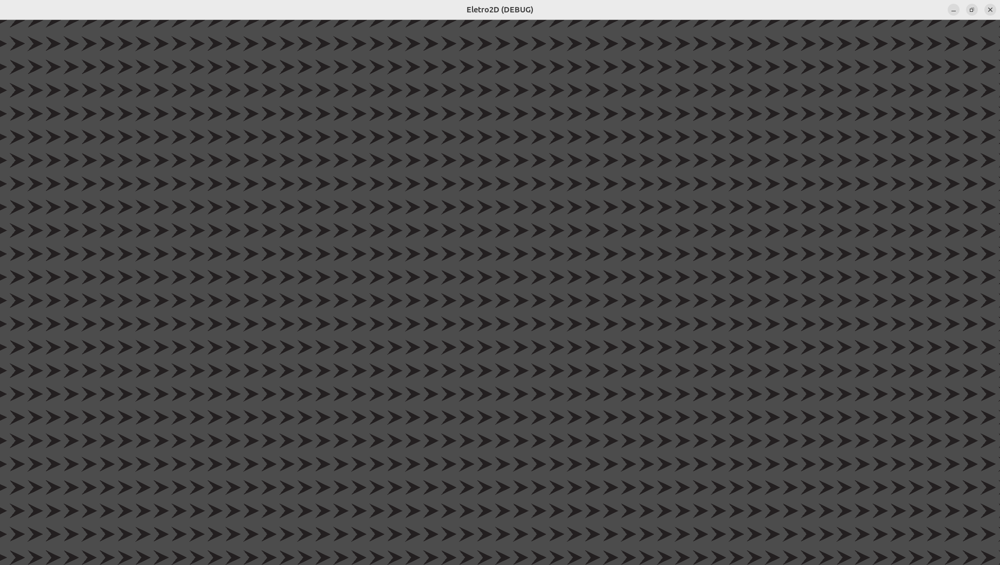
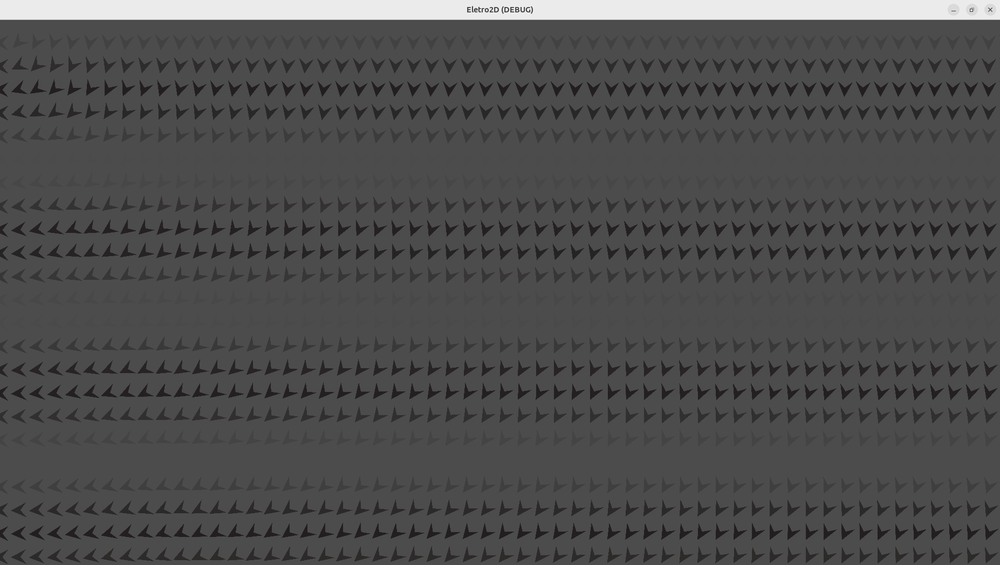

<style>
.site-header {
  display: none;
}
</style>


<head>
<style>
a {
  color: #59b390;
  text-decoration: none;
}
a:hover {
  color: #006400;
  text-decoration: underline;
}
</style>
</head>

<!-- Enables MathJax -->
<script type="text/javascript" async
  src="https://cdn.jsdelivr.net/npm/mathjax@3/es5/tex-mml-chtml.js">
</script>

# 2D Electromagnetism

Electromagnetism in two dimensions is rewritten analogously to the three-dimensional model, but the laws and equations are still different. Thus, the content presented here involves a numerical modeling of Maxwell's equations to simulate the motion of point charges and the electric and magnetic fields in space. The entire theoretical model of Maxwell's equations rewritten for a two-dimensional world is based on the article "On Maxwell’s Electrodynamics in Two Spatial Dimensions", while the computational model is original. While the theory behind the equations can be somewhat complex, applying it in this simulation only requires basic knowledge of differential equations, and the implementation difficulty increases progressively.

## Point Charges and the Electric Field

### Gauss's Law

In two dimensions, Gauss's law takes a similar form, but both the charge density and the divergence must also be calculated in two dimensions.

$$
\vec{E} \equiv (E_x, E_y)
$$

$$
\nabla \equiv \frac{\partial E_x}{\partial x} + \frac{\partial E_y}{\partial y}
$$

$$
\rho(x,y) \equiv \frac{dq}{dA}
$$

Gauss's law becomes:

$$
\nabla \cdot \vec{E} = \frac{\rho}{\epsilon_o}
$$

The charge density of a point charge can be modeled as a generalized function called the Dirac delta, which depends only on position and returns zero at every point in space except at the origin, where it returns infinity.

$$
\delta(\vec{r}) = 
\begin{cases}
\infty & \text{if } \vec{r} \neq \vec{0} \\
0             & \text{if } \vec{r} = \vec{0}
\end{cases}
$$

$$
\rho(\vec{r}) = q\delta(\vec{r})
$$

From this, we can deduce the expression for the electric field of a point charge. Integrating both sides over a circular area centered on our point charge, and using Gauss’s theorem in two dimensions to convert the area integral into a line integral along the circumference, we obtain a closed-form expression for the field of the charge:

$$
\int \int_C \nabla \cdot \vec{E} ~dA = \frac{\int \int_C \rho ~dA}{\epsilon_o} 
$$

$$
\oint_{\partial C} \vec{E} \cdot \hat{n} ~dr  = \frac{\int \int_C q\delta(\vec{r}) ~dA}{\epsilon_o} 
$$

$$
E \oint_{\partial C} ~dr  = \frac{q}{\epsilon_o} 
$$

$$
E (2 \pi |r|)  = \frac{q}{\epsilon_o} 
$$

$$
E = \frac{q}{2 \pi \epsilon_o |r|} 
$$

### Godot Setup

To begin writing our code, we need to have a few resources available in the editor. Therefore, we need to:

* Create a root node  
* Import an image of a positive charge  
* Import an image of a negative charge  
* Import an image of an arrow  


### Creating a Vector Field in Godot

To clearly visualize how the electric field changes when a charge is placed in a region of space, we need two pieces of information. First, the direction of the electric field must be defined at every point in space. Second, the field's intensity at each point. This will be represented by creating a grid of arrows pointing in the direction of the field at that point, with the arrow’s transparency indicating the field's intensity.

#### Variables

We start by creating the variables that define the region and the number of points in the grid we want to generate.

```gdscript
extends Node2D     # Object type of root node

var v_field = []   # Array of our vectors

var nx = 60        # Number of horizontal points
var ny = 30        # Number of vertical points
var lx = 2000      # Region size in x
var ly = 1300      # Region size in y
```

#### Creating the Arrows

To generate the arrows in the desired manner, we iterate over each point in our vector field, create an image object, define its texture, scale, and position, and then add it to the scene. Simultaneously with this arrow creation process, we also add these arrows to our matrix.


```gdscript
func _ready():
	gen_e_field(nx,ny)
	
func gen_e_field(nx,ny):
	for i in range(ny):
		v_field.append([])								# Add a row in v_field matrix    
		for j in range(nx):
			var v = Sprite2D.new()							# Create a sprite object
			v.texture = load("res://arrow.png")					# Set sprite texture as file "res://arrow.png"
			v.scale = Vector2(1,1)*0.1						# Set sprite scale as 0.1
			v.global_position = Vector2(j/float(nx)*lx,i/float(ny)*ly)		# Set sprite position to a fraction of lx and ly 
			add_child(v)								# Add sprite to our scene
			
			v_field[i].append(v)							# Add sprite to v_field matrix
```




#### Modifying the Field

If you run your simulation now, you will see several arrows lined up, all pointing in the same direction. This is expected, as we haven't yet modified their direction or color. Fortunately, we can manipulate both easily in Godot.

```gdscript
func _ready():
	gen_e_field(nx,ny)
	update_vectors()

func update_vectors():
	for i in range(ny):
		for j in range(nx):
			var norm = sin(i/2.0)**2			# Set a variable of vector norm 
			var dir = Vector2(-i,j)				# Set a variable of vector direction
			v_field[i][j].modulate.a = norm			# Set alpha component of the color of our arrow as norm
			v_field[i][j].rotation = dir.angle()		# Set the rotation of our arrow as the angle of direction with x axis
```

What we just did was simply assign the transparency of our arrows using a function of their position, and we did the same for their direction. We will not use these function to our eletric field, but this method is general for any function we want.




### Creating a Charge

One way to represent a point charge in our simulation is through a visual image.  
However, beyond its appearance, a point charge also has a **position**, a **velocity**, and, naturally, a **charge**.

To encapsulate both the **visual** and **mathematical** characteristics of the charge, we define it as an object.

In **Godot**, objects are defined as classes that can store:

- Variables
- Functions
- Other objects

```gdscript
class charge:
	extends Sprite2D
	var q = 1
	var vel = Vector2(0,0)
	func _init(q,pos):
		self.q = q
		self.global_position = pos
		
		if q < 0:
			texture = load("res://negativa.png")
			self.scale = Vector2(1,1)*0.05
		else:
			texture = load("res://positiva.png")
			self.scale = Vector2(1,1)*0.08
```

---

We define a class that:

- Inherits from `Sprite`
- Contains variables for `charge` and `velocity`
- Receives initial values for `charge` and `position` upon creation
- Sets its texture dynamically based on the charge value

This allows us to represent the charge both visually and physically within the simulation.
