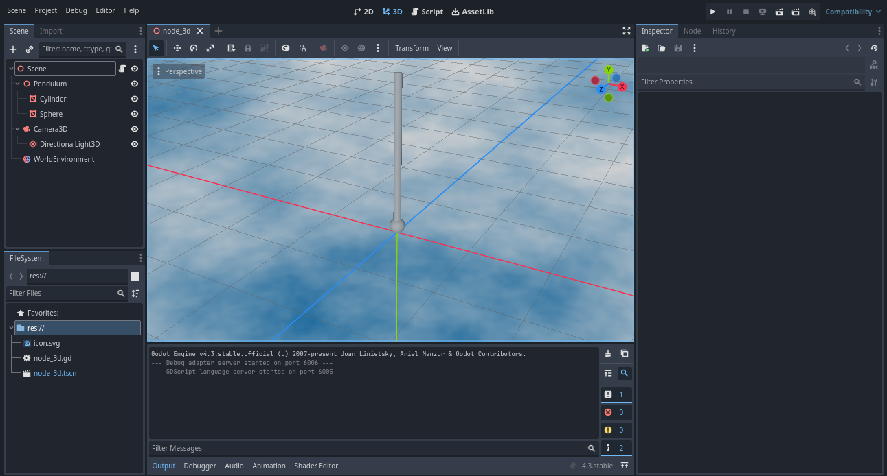

<!-- Enables MathJax -->
<script type="text/javascript" async
  src="https://cdn.jsdelivr.net/npm/mathjax@3/es5/tex-mml-chtml.js">
</script>

# Damped Pendulum

The pendulum is one of the simplest mechanical systems. However, the presence of a nonlinear term in its equation of motion complicates the analysis, and in general, an exact analytical solution is not available. One way to study the behavior of this system is through **numerical methods**.

In this case, the **Euler method** — one of the simplest algorithms for solving differential equations — is used to simulate the motion of a damped pendulum. The simulation was implemented using the **Godot** engine.

Furthermore, mouse interaction has been implemented, allowing the pendulum to be moved directly by the user. System parameters such as the pendulum's length and air viscosity can also be freely adjusted.

---

## Physical Model

The system consists of a rigid, massless rod of length \\( L \\), fixed at one end, with a point mass \\( m \\) attached to the other. The pendulum forms an angle \\( \theta \\) with the vertical and is subject to gravity acting downward.

Due to the constraint imposed by the rod, the motion occurs only in the angular direction. The angular component of the gravitational force is:

$$
\vec{F}_\theta = -mg \sin(\theta)\hat{\theta}
$$

Applying Newton's second law:

$$
\vec{F} = m \ddot{\vec{r}} = -mg \sin(\theta)\hat{\theta}
$$

$$
\ddot{\vec{r}} = -g \sin(\theta)\hat{\theta}
$$

Using the arc length relation \\( \mathrm{d} \vec{r} = L\, \mathrm{d} \hat{\theta} \\), we get:

$$
\dot{\vec{r}} = L \dot{\hat{\theta}}
$$

Taking another derivative and projecting onto the angular coordinate:

$$
L \ddot{\theta} = -g \sin(\theta)
$$

So:

$$
\ddot{\theta} = -\frac{g}{L} \sin(\theta)
$$

This is a **nonlinear second-order differential equation**, for which a general analytical solution does not exist.

---

## Numerical Methods

### Euler's Method

Taylor expansion allows us to write most functions as a power series. If \\( x \\) is a point in the domain of the function and \\( a \\) is a known point, we can write \\( f(x) \\) as:

$$
f(x) = f(a) + f'(a)(x - a) + \frac{f''(a)}{2!}(x - a)^2 + \cdots
$$

For an initial value problem, we know \\( f(t) \\) and want to calculate \\( f \\) a short time ahead, at \\( t + \Delta t \\). Thus, we take \\( x = t + \Delta t \\) and \\( a = t \\).

$$
f(t + \Delta t) = f(t) + f'(t)\Delta t + \frac{f''(t)}{2!}(\Delta t)^2 + \cdots
$$

If \\( \Delta t \\) is sufficiently small, then \\( (\Delta t)^2 \\) and higher powers of \\( \Delta t \\) will be even smaller. So we can discard the remaining powers of \\( \Delta t \\), with an error on the order of \\( \Delta t^2 \\).

$$
f(t + \Delta t) \approx f(t) + f'(t)\Delta t
$$

Therefore, if we know \\( f(t) \\) and \\( f'(t) \\), we can approximate \\( f(t + \Delta t) \\).

### Applying the Method to Our Problem

Unfortunately, Euler's method can only be directly applied to equations where we know the derivative as a function of the independent variables and the function itself — and in our equation we only have the relationship of \\( \ddot{\theta} \\) with \\( \theta \\).

To solve this, we use a simple trick: define a new variable \\( u \\).

$$
u = \dot{\theta}
$$

Therefore:

$$
\dot{u} = \ddot{\theta}
$$

The equation we had before becomes:

$$
\dot{u} = -\frac{g}{L} \sin(\theta)
$$

$$
\dot{\theta} = u
$$

We first use Euler’s method to find \\( u \\) with the first equation, and then use the newly calculated \\( u \\) to find \\( \theta \\) with the second equation.

Euler's method then proceeds in two steps:

1. Update the velocity:

   $$
   u(t + \Delta t) = u(t) - \frac{g}{L} \sin(\theta(t))\, \Delta t
   $$

2. Update the angle:

   $$
   \theta(t + \Delta t) = \theta(t) + u(t + \Delta t)\, \Delta t
   $$
   
> **Note:** One could use \\( u(t) \\) instead of \\( u(t + \Delta t) \\) in the second update step, and this would still be consistent with Euler’s method. However, using the most recently updated value makes the method slightly more robust in practice.  
> Moreover, when \\( \Delta t \\) is small, we have \\( u(t + \Delta t) \approx u(t) \\), so the difference is not significant.

## Godot Setup

Para performar essa simulação no **Godot**,
* Criar uma cena 3D
* Adicionar uma câmera
* Adicionar um Nó 3D que será o pênduo
* Adicionar um mesh com forma de cilindro para a aste dentro do nó do Pendulo
* Mover a o cilindro verticalmente para baixo até a sua ponta de cima ficar no centro do Nó do Pendulo
* Adicionar um mesh com forma de esfera para a massa do Pendulo
* Adicionar um script à raiz da cena 3D
* (Opcional) Adicionar um ambiente
  


## Godot Scripting

### Variables

Godot’s scripting language is very similar to Python, but it has some specific features. To define a variable, we write:

```gdscript
var variable_name = variable_valueQUando escrevemos dessa maneira, o tipo da variável já é definido como o tipo do valor que colocamos.

When written this way, the variable type is inferred from the assigned value.

Now let’s open the script and define the variables we’ll use. In this case, we create variables for the time step \( \Delta t \), the angle \( \theta \), the angular velocity \( \dot{\theta} \), gravity, and the pendulum’s length — named respectively as `dt`, `theta`, `dtheta`, `g`, and `L`. These variables are not parameters of any Godot object, but we will later link them to physical properties.

```
extends Node3D

var dt = 0.01
var theta = 1.4
var dtheta = 0
var g = -9.8
var L = 1
```

The `extends Node3D` line is not a variable, but it is mandatory for the script to run, as it determines the type of the root node object.

### Euler Method

Our goal here is not to solve a differential equation with maximum precision, but rather in a way that is visually appealing and physically reasonable. Therefore, we will have Godot compute new values for \( \theta \) at each frame. To do this, we will use the `_physics_process(delta)` function, which is executed once per frame.

By applying the equations we previously derived, we obtain the following code:e new values for \( \theta \) at each frame. To do this, we will use the `_physics_process(delta)` function, which is executed once per frame.

By applying the equations we previously derived, we obtain the following code:

```
func _physics_process(delta: float) -> void:
  dtheta += g*sin(theta)/L*dt
  theta += dtheta*dt
  $Pendulum.rotation.z = theta
```
Lines 2 and 3 correspond exactly to the equations we discussed earlier, while line 4 updates the rotation of the pendulum object around the z-axis using the variable `theta`.

Once the simulation is executed in Godot, we should already observe the pendulum in motion.

### Time Correction

If you change the value of the time step, you will likely notice that it affects the pendulum's speed. This may seem odd, as the time step is not a physical parameter. However, we must take into account that there is no clear relationship between simulation time and the time we observe. (Any resemblance to relativity is purely coincidental.) If your time step is 0.1 and the simulation physics runs at 60 iterations per second, then the simulation will be six times faster than what would happen in real life.

There are two ways to adjust this. The first is to use the `delta` parameter received by the `_physics_process` function. This parameter returns a value equal to \( \frac{1}{\text{FPS}} \), so if we define `dt = delta`, we have:

$$
\text{simulation time per second} = \Delta t \times \text{FPS} = \frac{1}{\text{FPS}} \times \text{FPS} = 1
$$

That is, one second of simulation corresponds to one second of real time. This resolves our problem, at the cost of some precision.

```
func _physics_process(delta):
  dt = delta
  dtheta += g*sin(theta)/L*dt
  theta += dtheta*dt
  $Pendulum.rotation.z = theta

```

The second approach is to force Godot to increase the processing speed. This allows you to increase the precision up to the limit your machine can handle. To do this, we use the `_ready()` function, which is called as soon as the simulation starts. Inside it, we set the number of physics iterations per second to \( \frac{1}{\Delta t} \), so that:

$$
\Delta t \times \text{FPS} = \Delta t \times \frac{1}{\Delta t} = 1
$$

That is, one second of simulation corresponds to one second of real time.

```
func _ready():
	Engine.physics_ticks_per_second = 1/dt
```

### Mouse Interaction

To begin implementing user interaction, we need to add the mouse click command to the input list. To do this, navigate to **Project -> Project Settings -> Input Map -> Add New Action**, enter the name "mouse" (or any name you prefer), and click the **Add** button. Then, locate the newly created action in the list below and click the **+** button to assign the desired mouse button.

With this setup, we will modify the processing loop so that it solves the equation of motion when the mouse is not being clicked, and updates the pendulum angle based on the mouse position when the mouse button is pressed.

```
func _physics_process(delta):
	if not Input.is_action_pressed("mouse"):
		dtheta += g*sin(theta)/L*dt
		theta += dtheta*dt
	else:
		theta = get_viewport().get_mouse_position().x/100
		dtheta = 0
	$Pendulum.rotation.z = theta
```

The first part is clearly the solution to the equation of motion we wrote earlier. The command `Input.is_action_pressed("mouse")` returns true when the mouse button is pressed, and false otherwise, allowing us to distinguish between these two cases. Line 6 updates the variable `theta` based on the mouse’s x-position within the viewport, multiplied by a sensitivity factor, and line 7 resets the pendulum’s angular velocity to zero.


